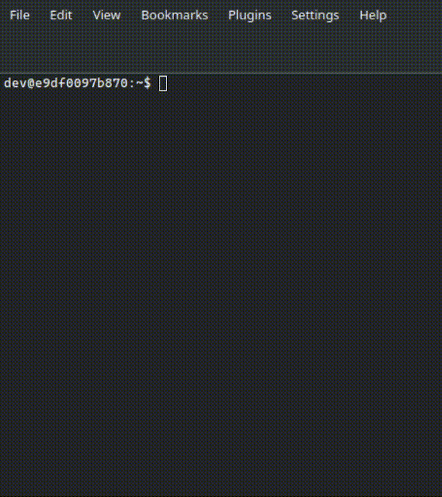

# `fzf_complete.bash`

Fuzzy filter `bash` completions with [`fzf`](https://github.com/junegunn/fzf).



## Requirements
- Bash 5.3: `fzf_complete` leverages `export-completions` readline function,
  introduced only in version 5.3
- `python3`
- `pexpect`
    - With `apt`, `apt install python3-pexpect`

## Installation

*Note*: instead of `~/.fzf_complete.bash/` you can use the path you prefer.

### Using `curl`

```bash
mkdir -p ~/.fzf_complete.bash && tar -xzf <(curl -L http://api.github.com/repos/mnalli/fzf_complete.bash/tarball -o -) -C ~/.fzf_complete.bash --strip-components=1
echo 'source ~/.fzf_complete.bash/fzf_complete.bash' >> ~/.bashrc
```

### Using `git clone`

```sh
git clone https://github.com/mnalli/fzf_complete.bash.git --depth=1 ~/.fzf_complete.bash
echo 'source ~/.fzf_complete.bash/fzf_complete.bash' >> ~/.bashrc
```

## Configuration

`fzf_complete` must be bound to a key to be used interactively. Put the following
snippet in your `.bashrc`:

```bash
# bind to Alt-TAB
bind -x '"\e\t": "fzf_complete"'
```

*Note*: `Alt-TAB` may be intercepted by your windows manager or terminal. In that
case, you could use bind another key.

## How does it work?

`bin/export-completions` acts as a pseudo-terminal (**PTY**) that allocates an
interactive `bash` shell, sets its command line buffer, and triggers the
`export-completions` readline function. Its output will be processed by
`fzf_complete` and piped into `fzf`.
